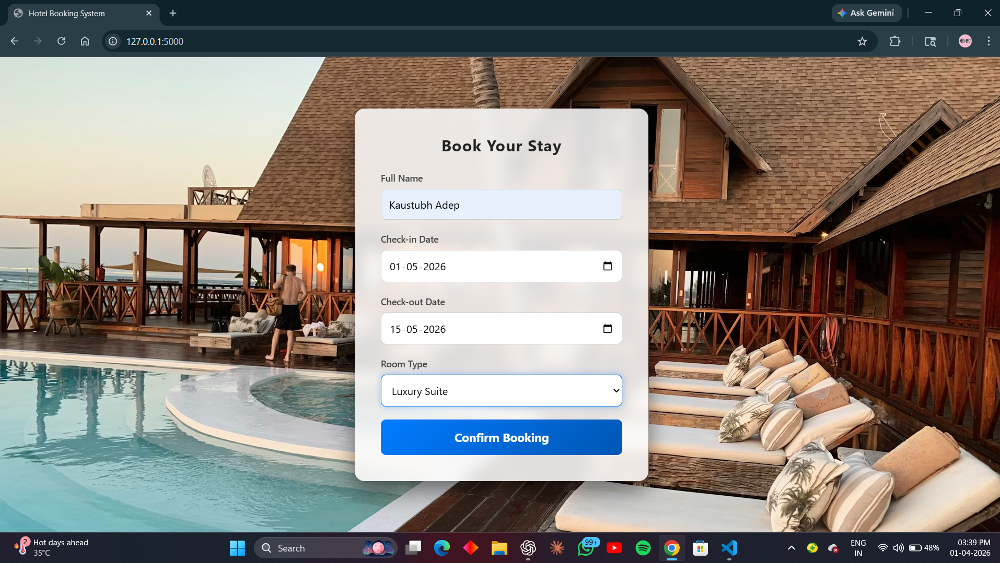
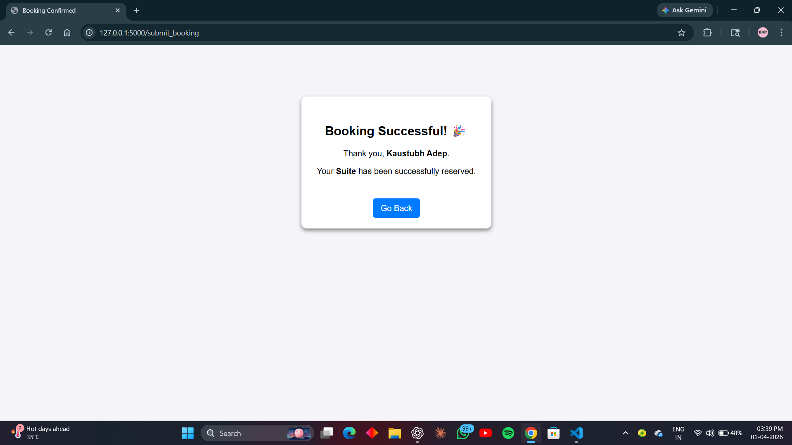
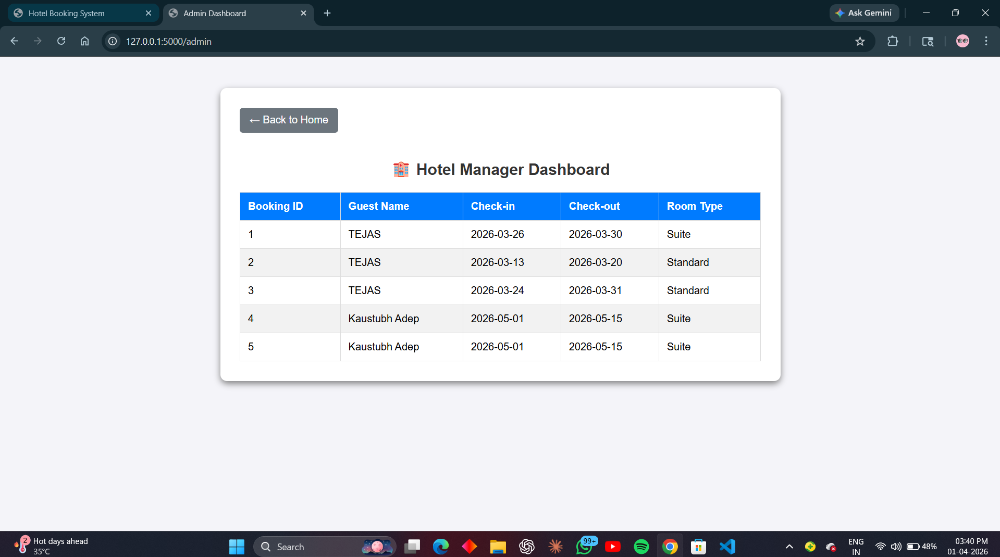

# 🌐 Hotel Booking System

A web-based hotel booking system built using Flask that allows users to book rooms and view bookings through an admin panel.

---

## 🚀 Features
- 📝 Book hotel rooms
- 📅 Select check-in and check-out dates
- 🏨 Choose room type
- 📊 View all bookings (Admin Panel)

---

## 🛠 Tech Stack
- Python (Flask)
- SQLite
- HTML / CSS

---

## 🌐 Live Demo
https://hotel-booking-project-80ln.onrender.com

---

## 📸 Screenshots

### 🏠 Home Page

### ✅ Booking Success

### 📊 Admin Panel

---

## ⚙️ How to Run Locally

1. Install dependencies:
   pip install flask

2. Run the app:
   python app.py

3. Open in browser:
   http://127.0.0.1:5000

---

## 📂 Project Structure
hotel-project-project/
│
├── app.py
├── hotel.db
├── templates/
│ ├── index.html
│ ├── success.html
│ ├── admin.html

---

## 👨‍💻 Author
Gaurav Salunke
